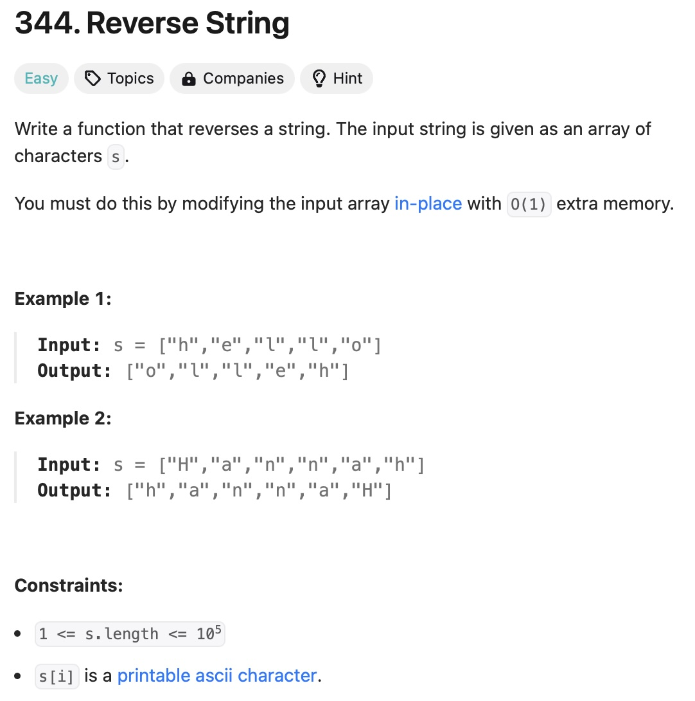
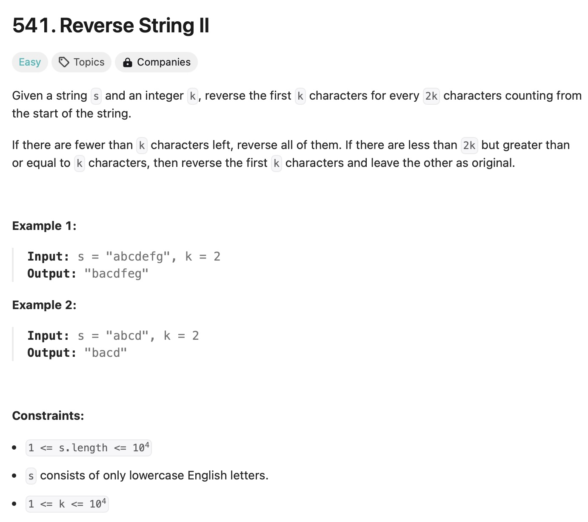
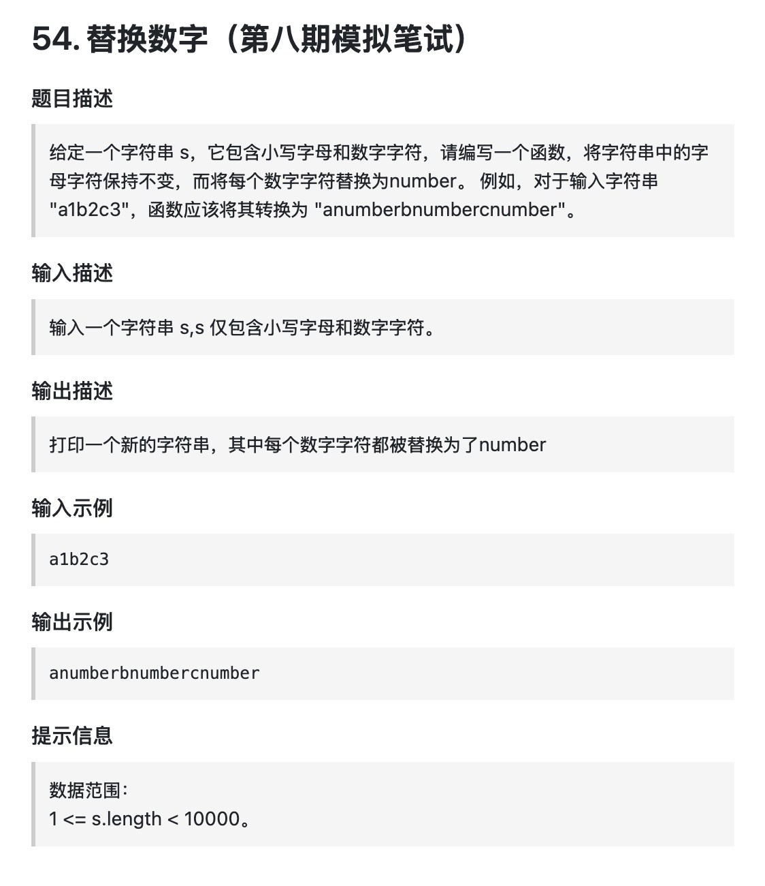

#  [344.反转字符串](https://leetcode.cn/problems/reverse-string/) 




1. 思路


```python
def add(a, b):
    return a + b

```


#  [ 541. 反转字符串II](https://leetcode.com/problems/reverse-string-ii/description/) 



思路： 

# Code Block  

Here is an example of a Python function using fenced code blocks:

```python
def add(a, b):
    return a + b

```


#  [ 卡码网：54.替换数字 ](https://kamacoder.com/problempage.php?pid=1064) 



思路： 

# Code Block Examples

Here is an example of a Python function using fenced code blocks:

```python
def add(a, b):
    return a + b

```


# References

1. **DAY 8 任务**. [https://docs.qq.com/doc/DUGdsY2JFaFhDRVZH](https://docs.qq.com/doc/DUGdsY2JFaFhDRVZH).  